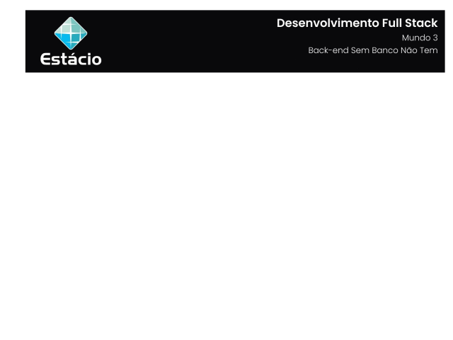

---

[Projeto](#-projeto) • [Como baixar e executar](#-como-baixar-e-executar) • [Procedimentos](#-procedimentos) • [Tecnologias utilizadas](#-tecnologias-utilizadas) • [Autor](#-autor) • [Licença](#-licença)

---

## 📋 Projeto

Missão Prática com o objetivo de desenvolver um aplicativo Java de cadastro conectado a um banco de dados SQL Server usando JDBC e seguindo o padrão DAO apresentado no **`Nível 3: Back-end Sem Banco Não Tem`** do **`Mundo 3`** do curso de **`Desenvolvimento Full Stack`** da **`Estácio`**, do semestre de **`2024.2`**, sob a tutoria de Simone Gama.

Projeto elaborado de acordo com as diretrizes especificadas para a Missão Prática, que podem ser conferidas [**`clicando aqui`**](https://sway.cloud.microsoft/s/G2pmewi1ksVR72or/embed).

## 📥 Como baixar e executar

Para baixar os arquivos deste repositório, você deve ter o [GitHub](https://github.com/) instalado em seu dispositivo.

Além disso, faz-se necessário ter previamente instalado os softwares [SQL Server](https://www.microsoft.com/pt-br/sql-server/sql-server-downloads) e [SQL Server Management Studio](https://learn.microsoft.com/en-us/sql/ssms/download-sql-server-management-studio-ssms?view=sql-server-ver16#download-ssms), além de uma IDE para desenvolvimento em Java.

## 🔗 Procedimentos

Durante o projeto foram desenvolvidos 02 procedimentos descritos abaixo:

<table>
  <tr>
    <th>Procedimento</th>
    <th>Descrição</th>
  </tr>
  <tr>
    <td>Mapeamento objeto-relacional e DAO</td>
    <td>
      <ul>
        <li>Configurar o projeto e adicionar o driver JDBC para SQL Server.</li>
        <li>Configurar o acesso ao banco de dados.</li>
        <li>Criar classes de modelo (Pessoa, PessoaFisica, PessoaJuridica).</li>
        <li>Implementar classes utilitárias (ConectorBD, SequenceManager).</li>
        <li>Implementar classes DAO (PessoaFisicaDAO, PessoaJuridicaDAO).</li>
        <li>Criar uma classe principal de testes (CadastroBDTeste) para realizar operações básicas no banco de dados.</li>
      </ul>
    </td>
  </tr>
  <tr>
    <td>Alimentando a base</td>
    <td>
      <ul>
        <li>Implementar um menu em modo texto para interação com o usuário.</li>
        <li>Permitir inclusão, alteração, exclusão e consulta de dados no banco de dados..</li>
        <li>Tratar exceções que possam ocorrer durante a execução do sistema.</li>
        <li>Testar as funcionalidades do sistema e verificar os dados no SQL Server.</li>
      </ul>
    </td>
  </tr>
</table>

Para acessar o relatório da Missão Prática, clique no botão abaixo:

## 🛠 Tecnologias utilizadas

Para a construção e execução do projeto foram utilizadas as seguintes tecnologias:

  

## 👥 Autor

| Aluno                                                  | Matrícula    | E-mail                                      |
| ------------------------------------------------------ | ------------ | ------------------------------------------- |
| [GUSTAVO CALIL](https://github.com/gustavocalil-github) | 202304625751 | [📧](mailto:202304625751@alunos.estacio.br) |

## 📃 Licença

Este repositório está licensiado sob a [Licença MIT](./LICENSE.txt).

